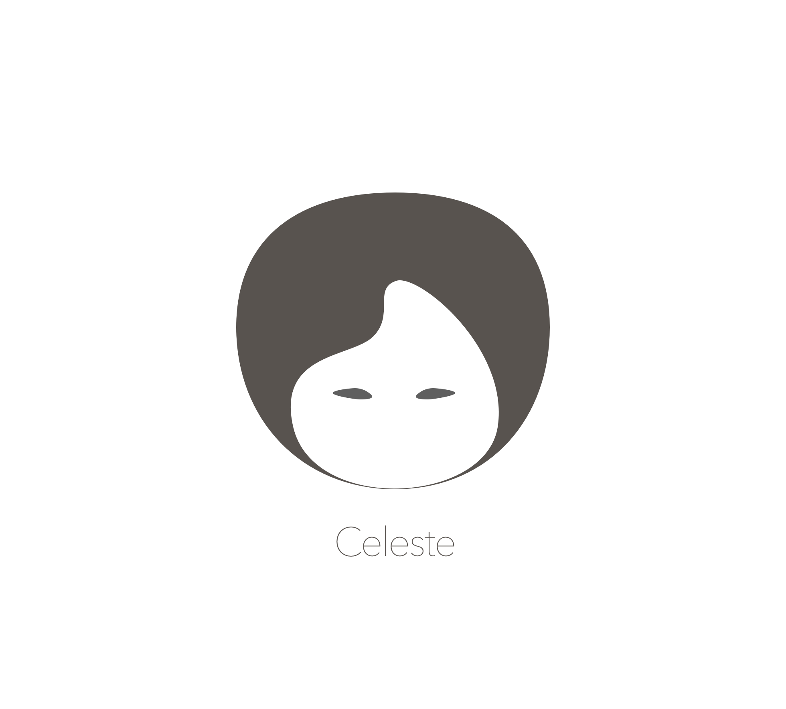

An all-in-one tool for the awesome list maintainer.


## Features

✅ Get Star data from Github, update in-place, report diffs and trends  
✅ Sort lists based on star counts (preserve structure)  
✅ Generate a TOC and embed into README  


## Quick Start

```
$ yarn add --dev celeste
$ celeste -f README.md -o OUT.md
react-native-swiper ★6881	 +54 (6827 -> 6881)
..
<< review >>
$ mv OUT.md README.md
```

## Integrations

By default `celeste` uses a text formatter for reporting its findings, the text format is parseable and readable and is perfect for CI system logs.

However should you want to integrate with other scripts and tools, all data can be output as `json`:

```
$ celeste -f README.md -o OUT.md --report json
{"type":"plugins/fetch-stars/update","level":"info","payload":{"title":"React Native Styling Cheatsheet ★2632","diff":43,"from":2589,"to":2632}}
...
```

## Plugins

Internally this tool is structured into plugins. Plugins are [unifiedjs](https://github.com/unifiedjs/unified) based and have a standard logging payload format:

```js
{
    "type":"plugins/fetch-stars/update",
    "level":"info",
    "payload":{...}
}
```

See more in [LogMessage](src/types.js).

# Contributing

Fork, implement, add tests, pull request, get my everlasting thanks and a respectable place here :).

### Thanks:

To all [Contributors](https://github.com/jondot/celeste/graphs/contributors) - you make this happen, thanks!

# Copyright

Copyright (c) 2018 [@jondot](http://twitter.com/jondot). See [LICENSE](LICENSE.txt) for further details.
